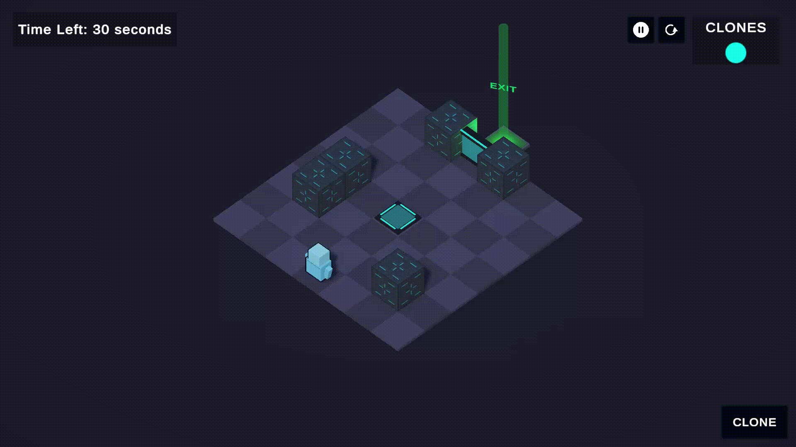
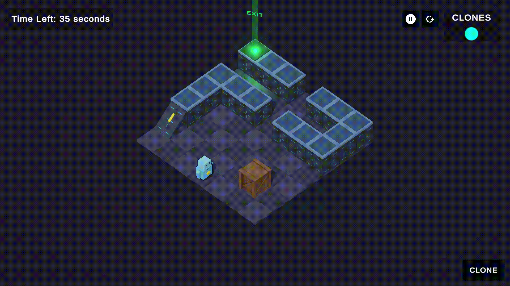

# Temporal Echo

> **Solve puzzles together with your past selves.**

Temporal Echo is a puzzle game built around a time-clone mechanic.

The player can record their actions and create clones that replay those actions. By cooperating with their past selves, players can solve puzzles that would otherwise be impossible to complete alone.

The game is independently developed using **Unity and C#**.

---

## 🎬 Trailer

[Watch the Temporal Echo Trailer](https://drive.google.com/file/d/1fF9CMgP0KFvGJqrpRR0kongFRP1gkNtv/view?usp=drive_link)

---

## 🎮 Gameplay

The core gameplay loop is simple:

1. Record your actions.
2. Create a time clone.
3. Let your past self repeat those actions.
4. Cooperate with your clones.
5. Solve the puzzle.

As the levels become more complex, players need to carefully plan **when and how they record their actions**.

### Level 1

  

The first level introduces the core time-clone mechanic and teaches the player how to interact with their past self.

### Level 6

  

Later levels build upon the core mechanic and require more careful planning and coordination between the player and their clones.

---

## ✨ Features

- Time-clone based puzzle mechanics
- Record and replay player actions
- Cooperate with multiple clones
- Puzzle design based on timing and coordination
- Six playable levels
- Progressive introduction of the core mechanic
- Independently developed game

---

## 🧠 Technical Highlights

The project focuses on building a reliable and reusable system for recording and replaying player actions.

- **Player State Recording**  
  Records relevant player actions and state during gameplay.

- **Action Replay System**  
  Replays previously recorded player behavior through time clones.

- **Clone Synchronization**  
  Manages multiple clones and their interactions with the game world.

- **Puzzle Systems**  
  Gameplay systems such as switches, doors and environmental interactions are designed around the time-clone mechanic.

- **Level-Based Architecture**  
  Levels are built using reusable gameplay systems and components.

- **Input & State Management**  
  Separates player input, recorded state and replay behavior.

---

## 🛠️ Technologies

- **Engine:** Unity
- **Language:** C#
- **Version Control:** Git / GitHub

---

## 🎨 My Contributions

Temporal Echo is an independently developed project.

My responsibilities include:

- Game design
- Programming
- Gameplay systems
- Time-clone recording and replay mechanics
- Puzzle design
- Level design
- UI implementation
- Audio integration
- Testing and debugging
- Game polish

---

## 📈 Development

Temporal Echo started as an experiment around the idea of cooperating with previous versions of yourself.

The project currently contains **six playable levels** built around the core time-clone mechanic.

The current development focus is on **polishing the existing gameplay rather than continuously expanding the scope**.

Planned development includes:

- Gameplay polish
- Tutorial and onboarding
- UI and menu improvements
- Audio and visual polish
- Playtesting
- Trailer and promotional material
- Steam release preparation

---

## 🎯 Project Goal

Temporal Echo is being developed as my first independently released commercial game.

The goal is to take the project through the complete game development cycle:

**Concept → Development → Polish → Playtesting → Marketing → Release → Player Feedback**

---

## 📌 Project Status

**In Development**

The current build contains six playable levels.

More information, screenshots, gameplay footage and a playable build will be added as development progresses.

---

## 📬 Contact

Feel free to explore the repository and follow the development of Temporal Echo.
